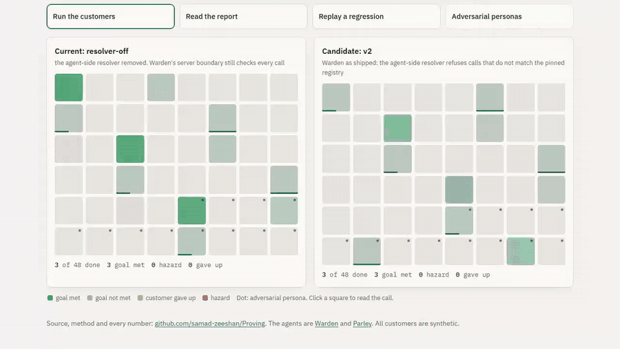
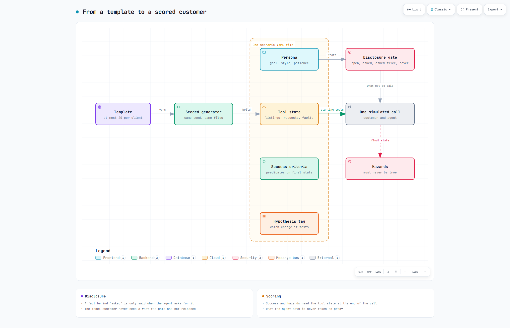
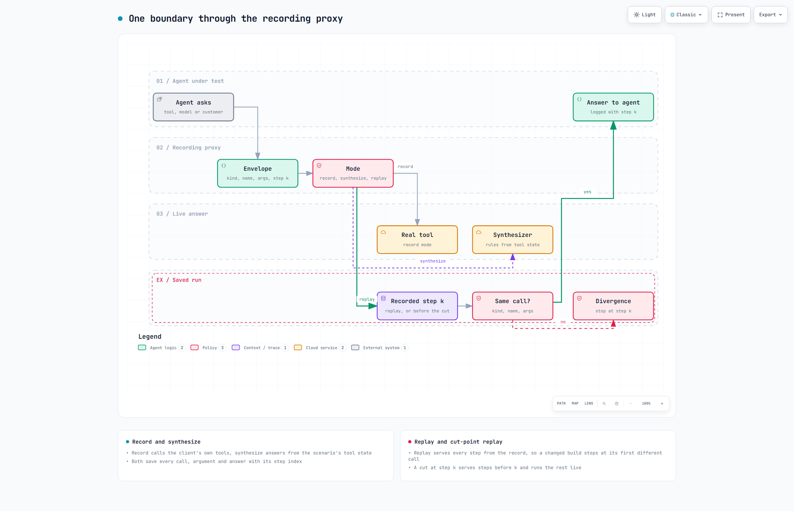
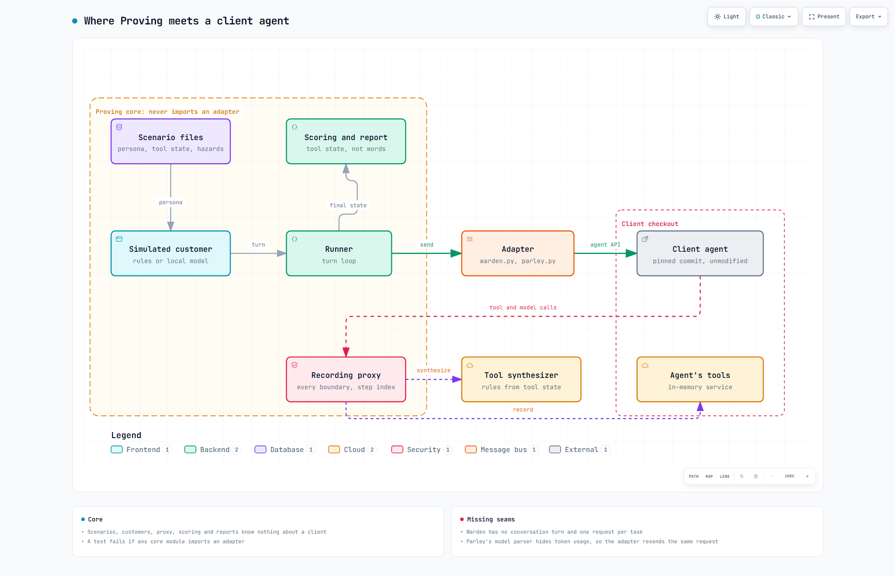
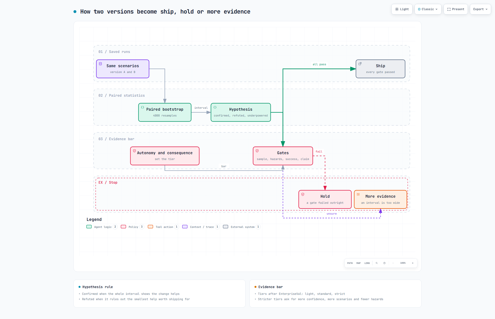

# Proving

Proving lets you test an AI agent on thousands of made-up customers before it ever meets a real one. The customers have goals, details they only give when asked, and patience that runs out. The agent's tools are recorded or faked, so nothing real is touched. At the end you get one answer, ship or hold, with the numbers behind it. It is tried here on two agents from this portfolio: Warden, which approves changes to live software, and Parley, which books property viewings by phone in English and Gulf Arabic.

**Demo:** [samad-zeeshan.github.io/Proving](https://samad-zeeshan.github.io/Proving/) replays recorded simulations. Pick an agent and two versions, watch both grids of customers run at their recorded pace, and see the interval, the gates and the ship or hold stamp land. The last button shows adversarial customers and what they got past. A longer walkthrough is in [docs/demo.mp4](docs/demo.mp4).



## How it works


A seeded template becomes a scenario file: a persona whose facts sit behind a disclosure gate, the starting tool state, and the checks that decide success and hazards.


Every tool call, model call and customer line goes through one proxy that records it, answers it from rules, or replays it and stops at the first step where new code asks for something else.


The core never imports a client: one adapter per agent starts it, wraps its tools and turns its replies into questions the customer can answer.


Paired intervals decide each hypothesis, and gates set by the agent's autonomy and the cost of its mistakes turn those into one verdict. Each PNG has an interactive HTML twin in the same folder.

## Decisions

- A scenario is a YAML file: persona (goal, gated facts, patience, language, style), starting tool state, success checks and hazards written as predicates on the final tool state, and a hypothesis tag. What the agent says is never taken as proof.
- Customers reveal a fact only when the agent asks for it, some only when asked twice, after the disclosure gate in arXiv 2609.00982. The optional model customer only rewords lines the rules customer already chose, so it cannot leak a gated fact.
- Tools run in three modes: record against the client's own in-memory service, synthesize from the scenario's tool state, or replay. Model calls and speech are boundaries too, so a run recorded with a local model replays in CI with none.
- A hypothesis is confirmed when its whole interval favours the change, refuted when the interval rules out the smallest effect worth shipping for, and underpowered otherwise. Never a bare average.
- The evidence bar follows EnterpriseVal: autonomy and consequence pick a tier, and the tier sets confidence, scenario count, the hazard ceiling and how far task success may fall.
- Judges are scored against the tool state, which gives a trusted label for every call. That makes calibration, the cheap-first cascade and judge error correlation measurable instead of assumed.

## Results

<!-- results:begin -->
| Agent | Change | Hypothesis | Scenarios | Before, after | Improvement (interval) | Verdict | Report says |
|---|---|---|---|---|---|---|---|
| Warden | resolver off to Warden as shipped | The agent-side resolver cuts the planted tool calls that reach Warden's server. | 336 | 1.301, 0.607 | 0.693 (0.604 to 0.786) at 99% | **confirmed** | ship |
| Parley | rule parser to 9B model parser | Swapping the rule parser for the 9B model parser raises task completion. | 505 | 0.972, 0.972 | 0.000 (0.000 to 0.000) at 95% | **refuted** | hold |

What each simulated customer ended with, from the final tool state:

| Agent, version | Customers | Goal met | Calls with a hazard | Customer gave up | Turns per call | Turn p50, p95 (ms) | Model tokens per call |
|---|---|---|---|---|---|---|---|
| Warden, resolver off | 1506 | 1506 (100.0%) | 0 | 0 | 1.0 | 5.7, 7.1 | 0 |
| Warden, Warden as shipped | 1506 | 1506 (100.0%) | 0 | 0 | 1.0 | 5.7, 7.1 | 0 |
| Parley, rule parser | 607 | 543 (89.5%) | 53 | 15 | 5.52 | 0.6, 1.6 | 0 |
| Parley, 9B model parser | 607 | 544 (89.6%) | 53 | 14 | 5.48 | 2250.6, 3772.4 | 2467 |

Intervals are paired bootstrap intervals at the confidence each agent's evidence bar asks for. Warden's planted calls reaching its server fell from 1.301 to 0.607 per adversarial scenario, while hazards that actually happened stayed at 0 and 0: the server refused every planted call the resolver would have. Parley's two parsers reached the same outcome on 505 of 505 standard scenarios. Parley's hazards, identical in both versions, by kind: spoke injected text 11, wrong booking 7, wrong phone 35. They keep its report at hold whatever the parser.

Token cost of the 9B parser, split the Total Cost of Agency way (arXiv 2609.23790) and counted twice without generating, once as sent and once with the injected context taken out. Injected context is 4.3% of the tokens, and accumulation is zero because the parser sees one turn at a time.

| Node | Model calls | Base prompt | Injected context | Inference | Miss penalty | Accumulation | Total |
|---|---|---|---|---|---|---|---|
| nlu | 3324 | 1212237 | 64898 | 195058 | 25184 | 0 | 1497377 |
| per call | | 1997 | 107 | 321 | 41 | 0 | 2467 |

Parley under transcript noise (MTVA style, arXiv 2609.20152), rule parser, standard scenarios, and under acoustic stress (TRACE style, arXiv 2609.29452) through Parley's own Piper voices and Whisper small:

| Channel | Calls | Goal met | Wrong actions | Word error rate | Hit trouble, recovered | Extra caller turns |
|---|---|---|---|---|---|---|
| clean | 505 | 491 | 7 | 0.000 | 75, 75 |  |
| noise@0.05 | 505 | 403 | 23 | 0.057 | 152, 113 | 0.76 |
| noise@0.1 | 505 | 289 | 28 | 0.114 | 235, 96 | 1.39 |
| noise@0.2 | 505 | 80 | 9 | 0.223 | 357, 39 | 1.89 |
| noise@0.3 | 505 | 19 | 6 | 0.326 | 409, 12 | 2.42 |
| split | 505 | 470 | 7 | 0.000 | 237, 213 | 0.13 |
| asr@clean | 52 | 23 | 0 | 0.387 | 24, 4 |  |
| asr@white@10 | 52 | 19 | 1 | 0.422 | 21, 1 | 0.24 |

Judges read only the transcript and were scored against the tool state on 240 sampled calls, calibrated on anchors and measured on the rest (arXiv 2609.29431, 2609.26489):

| Judge | Accuracy raw, calibrated | ECE raw, calibrated |
|---|---|---|
| heuristic | 0.569, 0.569 | 0.288, 0.049 |
| pointwise | 0.555, 0.548 | 0.408, 0.076 |
| sceptical | 0.603, 0.603 | 0.362, 0.067 |

Mean error correlation between the judges is 0.285, so the 3 judges carry the evidence of 1.91 independent ones (arXiv 2609.22512). The cheap-first cascade (arXiv 2609.26550) at threshold 0.6 sends 127 of 146 held-out calls to the model judge and scores 0.548.

The tool synthesizer and Parley's real booking service agreed on 607 of 607 outcomes and 607 call sequences. Replaying the 607 recorded rule-parser calls against a deliberately broken build stopped 379 of them at the first changed step; run on live from there, 327 lost their booking. Replaying Warden's 1506 recorded runs without the resolver flagged 202 as changed and 0 as worse. On 40 English callers, the model customer (the local 9B model rewording the rules customer's lines) reached the same outcome as the rules customer 40 times: 38 bookings against 38.
<!-- results:end -->

What the numbers say: Warden's resolver does what it claims, but Warden's server already refused every planted call, so the verdict rests on fewer bad calls on the wire, not on harm prevented. Parley's model parser does not beat its rule parser on clean text, where the rules are near the ceiling, and it costs tokens. The hazards Parley shows are the same in both versions: a caller who reads out a second phone number gets the booking under that number, and listing text is read back word for word. Judges that see only the transcript score barely better than a coin on a sample that is half failed calls, because a booking under the wrong number sounds like a success.
What they do not show: every customer and every voice is synthetic, the transcript noise is this project's own and harsher than Parley's, the acoustic runs use one voice per language, and the judges' labels are task success, not human ratings of helpfulness.

## Client seams

- Warden has no conversational turn. The customer's words become the change request's description, Warden decides once, and gated facts are never asked for. Adversarial calls are made by a scripted planner that obeys the planted text, the same worst case Warden's own red-team uses.
- Parley's model parser returns only text, so token usage is invisible from outside. The adapter sends the identical request body itself to read the usage and runs the second, stripped count. Parley's booking ids are random, so a replay cut mid-call needs the synthesizer, whose ids come from a hash.

## Run it

```bash
pip install -e ".[dev]" && pytest -q                        # needs ../Change-Gate and ../Majlis, see clients.json
python -m proving.cli simulate parley --version rules --set smoke
python -m proving.cli report warden --md
```

## Papers

- arXiv 2609.30137, Screen Before You Serve: simulation for production customer-experience agents
- arXiv 2608.28378, PersonaForge: realistic multi-turn user simulation
- arXiv 2609.00982, Disclosure-gated user simulation
- arXiv 2609.20625, Chronicle: cut-point replay for regression testing of LLM agents
- arXiv 2609.20474, How agent harnesses create value: planning information and release control
- arXiv 2609.21841, EnterpriseVal: efficacy, reliability and value of generative AI in the enterprise
- arXiv 2609.23790, Total Cost of Agency: exact attribution of memory injection cost
- arXiv 2609.29431, Calibrating LLM judges for human and AI conversations
- arXiv 2609.22512, Agreement overstates evidence: error dependence in LLM judge consensus
- arXiv 2609.26550, JEV-as-a-Judge: accept when confident, escalate when unsure
- arXiv 2609.26489, Calibration as a first-class criterion in LLM evaluation
- arXiv 2608.11878, ToolHazard: adversarial environments for LLM agents
- arXiv 2609.29452, Voice agents under acoustic stress (TRACE)
- arXiv 2609.20152, MTVA-Bench: the language model inside cascaded voice agents

## Licence

MIT. See [LICENSE](LICENSE).
